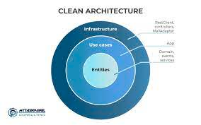

# mongo-query

### Pre-requisite

- Docker
- Java 17
- curl

## How to Run

Follow these steps to start the Spring Boot application:

* **Open Terminal:** Open a terminal on your machine
* **Navigate to the Project Directory:** Use the `cd` command to navigate to the root directory of your Spring Boot
  project
* **Set up mongo database** run `docker-compose up -d` to run the mongoDB docker
* **Run the Application:** Use the following command to start the Spring Boot application:

```bash
   ./mvnw install
   ./mvnw spring-boot:run -pl main -o
```

* **Initialize the database** run the follow curl to initialize the database

```curl
curl -X POST  http://localhost:8080/quotes/debug/init
```

This curl is to add 50000 entries to the database.

## Endpoints

[Open Api](openApi.yaml)

## Architecture



The architecture chosen was a simplification of clean architecture.

## Key Principles

1. **Independence from Frameworks**: Business logic and application rules remain independent of technical details, such
   as user interfaces, databases, or specific frameworks. This allows for easy adaptation to new technologies without
   affecting the core logic.

2. **Separation of Concerns**: Code is organized into concentric layers, with the innermost layer representing pure
   business logic, surrounded by outer layers handling presentation, controllers, and infrastructure. Each layer has a
   clearly defined set of responsibilities.

3. **Dependency Inversion Principle**: Dependencies flow from the outer layers to the inner layers, meaning that inner
   layers do not depend on outer layers. This promotes modularity and ease of unit testing.

4. **Testability**: Clean Architecture encourages writing unit and integration tests to ensure that the system functions
   correctly and can be confidently modified without breaking its functionality.

## Benefits

- Improved maintainability: Clean Architecture makes it easier to understand and modify the codebase over time.
- Scalability: The modular nature of the architecture allows for the addition of new features or components with minimal
  disruption.
- Technology agnosticism: It enables you to adapt to new technologies without a complete rewrite of the application.

Since there is no Business validation in this test I decided to omit the Domain layers, were the Business validations
should be.

# Improvements

**Logging** - the application right now does not log, logs is an important topic, the application should log the
request/responses and important executions, this can be done using Sl4J and LogBack.

**Docker** - The Java application is not running in the docker, include a Dockerfile and de java application inside the
docker-compose.

**Data initialization** - The data initialization could be done calling the API directly, the API give me some problems
and I decided not tu call the API, because I didn't to depend on an external endpoint that can done the application to
fail.

# Decisions

In order to improve the efficiency of the application I make the following decisions.

- **Make quoteAuthor indexable**
- **Pageable responses**

# Test reports

The test can be run using `./mvnw verify`
The tests report are generated inside report/target/site/index.html